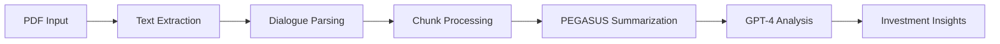

# 📊 Financial Dialogue Analysis Tool 💼

## 🚀 Overview
Transform lengthy earnings call transcripts into **actionable investment insights** using the power of advanced **NLP** and **AI models**! Our tool combines the precision of **PEGASUS** summarization with the analytical capabilities of **GPT-4** to deliver comprehensive financial analysis. 🎯

## ✨ Key Features

### 1. 📝 Intelligent Document Processing
* 📄 Seamless PDF transcript extraction
* 👥 Smart speaker-dialogue parsing
* 🧹 Advanced text cleaning and preprocessing

### 2. 🤖 Advanced AI Analysis
* 🎯 PEGASUS financial summarization
* 🧠 GPT-4 powered investment insights
* 📈 Structured analytical output

### 3. 💡 Smart Insights Generation
* 🔍 Growth prospect analysis
* 🔄 Business change identification
* ⚡ Investment catalyst detection
* 📊 Financial metric evaluation

### 4. 🛡️ Robust Processing
* ⚙️ Intelligent chunk management
* 🔄 Context preservation
* 🎯 Error handling & retry mechanisms

## 🏗️ Technical Architecture

### 🧠 Core Models

#### 📚 PEGASUS Financial Summarizer
* 🎯 Fine-tuned on Bloomberg financial articles
* 💼 Specialized in financial dialogue
* 📊 Preserves key metrics and context

#### 🤖 GPT-4 Analyzer
* 📈 Pattern recognition
* 🎯 Trend analysis
* ⚖️ Risk assessment
* 💡 Strategic insights

## 🛠️ Technology Stack

### 📚 Libraries & Frameworks
* 🐍 PyTorch & Transformers
* 📄 PyPDF2
* 🔤 NLTK
* 🌐 Requests

### 🔧 Processing Pipeline


## 📊 Analysis Categories

### 1. 📈 Growth Analysis
* 🎯 Market expansion opportunities
* 🆕 Product development initiatives
* 💹 Revenue growth drivers

### 2. 🔄 Business Evolution
* 👥 Management changes
* 🛠️ Operational updates
* 📋 Strategic shifts

### 3. ⚡ Investment Catalysts
* 🎯 Key milestones
* 🤝 Strategic partnerships
* 💡 Market opportunities

### 4. 📊 Financial Metrics
* 💰 Revenue analysis
* 📈 Margin trends
* 💼 Cost management

## 🚀 Getting Started

### 📋 Prerequisites
```bash
pip install transformers nltk torch PyPDF2 requests
```

### 🎯 Quick Start
```python
# Initialize analyzer
analyzer = FinancialAnalyzer(api_key="your_key")

# Process document
results = analyzer.process_document("earnings_call.pdf")

# Get insights
insights = results.get_investment_analysis()
```

## 💡 Use Cases

### 1. 📊 Investment Research
* 🔍 Due diligence
* 📈 Market analysis
* 💼 Competitive assessment

### 2. 📋 Financial Planning
* 🎯 Strategy development
* 💡 Risk assessment
* 📊 Performance tracking

## ✨ Benefits

### 1. ⚡ Efficiency
* 🚀 Rapid processing
* 🎯 Automated insights
* 📊 Structured output

### 2. 🎯 Accuracy
* 🤖 Multi-model validation
* 📈 Context preservation
* 💡 Financial expertise

### 3. 💼 Actionability
* 📋 Clear recommendations
* ⚖️ Risk awareness
* 🎯 Strategic focus

## 📝 License
This project is licensed under the MIT License - see the LICENSE file for details

## 🤝 Contributing
We welcome contributions! Please feel free to submit a Pull Request.

## 📧 Contact
For any queries, please reach out to [your-email@example.com]

---
⭐ Don't forget to star this repo if you found it useful! ⭐

# Detailed Code Explanation - Financial Dialogue Analysis Tool

## Imports and Initial Setup
```python
import torch
from transformers import PegasusTokenizer, PegasusForConditionalGeneration
import nltk
from nltk.tokenize import sent_tokenize
import re
import time
from typing import List, Dict, Any
import PyPDF2
import requests
from google.colab import files
import json
```
- `torch`: Deep learning framework used to run the PEGASUS model
- `transformers`: Hugging Face library containing the PEGASUS model and tokenizer
- `nltk` and `sent_tokenize`: Used for sentence tokenization in text processing
- `re`: Regular expressions library for text pattern matching
- `PyPDF2`: Library for extracting text from PDF files
- `requests`: For making HTTP requests to the GPT-4 API
- `google.colab`: For file handling in Google Colab environment

## DialogueSummarizer Class Initialization
```python
def __init__(self, chunk_size: int = 3000):
    try:
        nltk.data.find('tokenizers/punkt')
    except LookupError:
        nltk.download('punkt')

    self.chunk_size = chunk_size

    print("Loading Pegasus model...")
    self.model_name = "human-centered-summarization/financial-summarization-pegasus"
    self.tokenizer = PegasusTokenizer.from_pretrained(self.model_name)
    self.model = PegasusForConditionalGeneration.from_pretrained(self.model_name)

    self.device = torch.device('cuda' if torch.cuda.is_available() else 'cpu')
    self.model = self.model.to(self.device)
    print(f"Model loaded. Using device: {self.device}")
```
- Initializes with a default chunk size of 3000 characters
- Checks and downloads NLTK punkt tokenizer if not present
- Loads the financial PEGASUS model and tokenizer
- Detects if GPU (CUDA) is available and moves model to appropriate device

## PDF Text Extraction
```python
def extract_text_from_pdf(self, pdf_path: str) -> str:
    with open(pdf_path, 'rb') as file:
        pdf_reader = PyPDF2.PdfReader(file)
        text = ""
        for page in pdf_reader.pages:
            text += page.extract_text() + "\n"
    return text
```
- Opens PDF file in binary read mode
- Creates a PyPDF2 reader object
- Iterates through each page
- Extracts text and adds newline between pages
- Returns combined text from all pages

## Dialogue Parsing
```python
def parse_dialogue(self, text: str) -> List[Dict]:
    dialogue_segments = []
    lines = text.split('\n')
    current_speaker = None
    current_content = []

    for line in lines:
        line = line.strip()
        if not line:
            continue

        speaker_match = re.match(r'^([^:]+):\s*(.*)$', line)

        if speaker_match:
            if current_speaker and current_content:
                dialogue_segments.append({
                    'speaker': current_speaker,
                    'content': ' '.join(current_content)
                })
                current_content = []

            current_speaker = speaker_match.group(1).strip()
            content = speaker_match.group(2).strip()
            if content:
                current_content.append(content)
        else:
            if current_speaker:
                current_content.append(line)
```
- Splits text into lines
- Uses regex pattern `^([^:]+):\s*(.*)$` to identify speaker patterns:
  - `^` matches start of line
  - `[^:]+` matches any characters except colon
  - `:\s*` matches colon followed by optional whitespace
  - `(.*)$` matches rest of line until end
- Creates structured segments with speaker and content
- Handles multi-line dialogue content
- Maintains speaker context across line breaks

## Text Cleaning
```python
def clean_text(self, text: str) -> str:
    text = re.sub(r'\s+', ' ', text)
    text = re.sub(r'\n', '', text)
    text = ' '.join(text.split())
    return text.strip()
```
- Removes excessive whitespace using regex
- Removes newline characters
- Normalizes spacing between words
- Strips leading/trailing whitespace

## Chunk Creation
```python
def split_into_chunks(self, dialogue_segments: List[Dict]) -> List[List[Dict]]:
    chunks = []
    current_chunk = []
    current_length = 0

    for segment in dialogue_segments:
        segment_length = len(segment['content'])

        if current_length + segment_length > self.chunk_size:
            if current_chunk:
                chunks.append(current_chunk)
            current_chunk = [segment]
            current_length = segment_length
        else:
            current_chunk.append(segment)
            current_length += segment_length

    if current_chunk:
        chunks.append(current_chunk)

    return chunks
```
- Takes list of dialogue segments
- Tracks current chunk length
- Creates new chunk when size limit reached
- Ensures dialogue segments aren't split mid-conversation
- Maintains speaker-content relationship in chunks

## Chunk Formatting
```python
def format_chunk_for_summarization(self, chunk: List[Dict]) -> str:
    formatted_text = ""
    for segment in chunk:
        formatted_text += f"{segment['speaker']}: {segment['content']}\n"
    return formatted_text
```
- Takes a chunk of dialogue segments
- Reconstructs text in speaker: content format
- Adds newlines between segments
- Prepares text for PEGASUS model input

## Chunk Summarization
```python
def summarize_chunk(self, chunk: List[Dict], max_length: int = 150) -> str:
    formatted_text = self.format_chunk_for_summarization(chunk)

    inputs = self.tokenizer(formatted_text, return_tensors="pt", truncation=True, max_length=512)
    inputs = inputs.to(self.device)

    summary_ids = self.model.generate(
        inputs.input_ids,
        max_length=max_length,
        num_beams=4,
        length_penalty=2.0,
        early_stopping=True,
        no_repeat_ngram_size=3
    )

    summary = self.tokenizer.decode(summary_ids[0], skip_special_tokens=True)
    return summary
```
- Formats chunk for summarization
- Tokenizes text for PEGASUS model
- Moves inputs to appropriate device (CPU/GPU)
- Generates summary with parameters:
  - `max_length`: Maximum summary length
  - `num_beams`: Number of beams for beam search
  - `length_penalty`: Encourages longer summaries
  - `early_stopping`: Stops when maximum length reached
  - `no_repeat_ngram_size`: Prevents repetition
- Decodes summary tokens back to text

## GPT Analyzer Class
```python
class GPTAnalyzer:
    def __init__(self, api_key: str):
        self.url = "https://chatgpt-42.p.rapidapi.com/conversationgpt4-2"
        self.headers = {
            "x-rapidapi-key": api_key,
            "x-rapidapi-host": "chatgpt-42.p.rapidapi.com",
            "Content-Type": "application/json"
        }
```
- Initializes GPT-4 API connection
- Sets up headers with API key
- Configures endpoint URL

## Analysis Prompt Creation
```python
def create_analysis_prompt(self, text: str) -> str:
    return f"""As an investment advisor, analyze the following earnings call transcript
    and provide specific actionable insights for investors. Focus on:

    1. Future Growth Prospects:
    - Identify specific growth initiatives
    - Evaluate market expansion plans
    - Assess new product/service developments
    [...]
    """
```
- Creates structured prompt for GPT-4
- Focuses analysis on key investment areas
- Ensures consistent analysis format
- Requests specific, actionable insights

## GPT Analysis Request
```python
def get_gpt_analysis(self, text: str, max_retries: int = 3) -> Dict[str, Any]:
    prompt = self.create_analysis_prompt(text)
    payload = {
        "messages": [
            {
                "role": "user",
                "content": prompt
            }
        ],
        "system_prompt": "You are an experienced financial analyst providing detailed insights for investors.",
        "temperature": 0.7,
        "top_k": 5,
        "top_p": 0.9,
        "max_tokens": 1000,
        "web_access": False
    }

    for attempt in range(max_retries):
        try:
            response = requests.post(self.url, json=payload, headers=self.headers)
            response.raise_for_status()
            return response.json()
        except requests.exceptions.RequestException as e:
            if attempt == max_retries - 1:
                raise Exception(f"Failed to get GPT analysis after {max_retries} attempts: {str(e)}")
            time.sleep(2 ** attempt)
```
- Creates API payload with:
  - User prompt
  - System context
  - Generation parameters
- Implements retry mechanism with exponential backoff
- Handles API errors and rate limiting
- Returns parsed JSON response

## Main Function
```python
def main():
    api_key = "Refer to the email send to you"
    summarizer = DialogueSummarizer(chunk_size=1000)
    analyzer = GPTAnalyzer(api_key)

    print("Please upload your PDF file...")
    uploaded = files.upload()
    pdf_filename = list(uploaded.keys())[0]

    try:
        doc_results = summarizer.process_document(pdf_filename)
        combined_summary = doc_results['combined_summary']

        print("\nDocument Processing Results:")
        [...]

        analysis_results = analyzer.get_gpt_analysis(combined_summary)

        print("\nInvestment Analysis Results:")
        [...]

    except Exception as e:
        print(f"Error during document processing: {str(e)}")
        raise
```
- Sets up summarizer and analyzer instances
- Handles file upload through Google Colab
- Processes document and generates summaries
- Gets GPT-4 analysis of combined summary
- Prints results and handles errors
- Provides formatted output for user

This code creates a complete pipeline for analyzing financial dialogues, from PDF extraction through summarization to final investment analysis, with robust error handling and clear output formatting.
